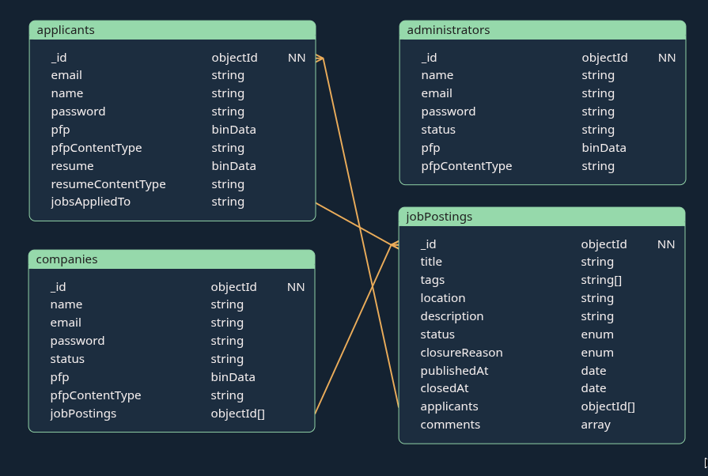

# Jobly
Our project is a Job Board and Career Portal that allows employers to post available jobs and for applicants to search and apply for jobs/positions. The platform supports multiple user roles including unregistered visitors, registered users (both employers and applicants), and administrators. Unregistered users can browse and search job postings without creating an account. Registered users must create a profile by signing up, and they must declare themselves to be either an employer or an applicant. Employers can post, edit, and manage their own job listings. Applicants can apply to jobs, upload their resume, and manage their personal profiles. Administrators oversee the platform by moderating content, managing user accounts, and viewing data analytics (e.g., user activity, number of job postings, number of users, number of employers). The goal of the system is to provide a structured, searchable job platform that demonstrates full-stack development using the MERN stack including authentication, role-based permissions, database-driven content, and responsive frontend design.

## Frontend System Architecture
TODO

## Backend System Architecture
We use a 3 layered architecture to keep our software and data secure while improving performance and eliminating the possibility of bugs. 

- **Controller:** Handles the HTTP routing, data validation and constucting response objects. This is where we define 
                  routes (GET or POST). It reads from the HTTP request sent by the frontend, calls the service and returns
                  the results as a JSON response to the frontend.
- **Service:** Handles the business logic. No HTTP or direct databse access. Once the controller calls a service method
               the service then calls the method in the repository that gets the relevant data. Once the data or a response
               is returned to the service it will be transferred to the controller to be returned to the frontend. This layer is
               also be responsible for operations of data such as hashing passwords when doing authentication. 
- **Repository:**  Handles the database operations, models and mock data.

**Flow Example (get one applicant):** The controller receives `GET /api/applicants/123` from the frontend, reads `req.params.id` and 
calls `applicantService.getApplicantById('123')`. Service receives the request by the controller and passes the id into 
`applicantRepository.findById(id)`. The repository receives this request and runs the MongoDB query which returns the document to the service. The service sends the document to the controller which will transform it to JSON and sends it to frontend. 

## Schema


## Setup

1. **Add you env**
   
   Create a .env file inside `/server/` and paste the reguired text shared with you. 

2. **Set up the server**
   ```bash
   cd server
   npm install
   ```

3. **Set up the client**
   ```bash
   cd client
   npm install
   ```

## Run the Application 

```bash
# Terminal 1 - Start the backend
cd server
npm run dev

# Terminal 2 - Start the frontend
cd client
npm run dev
```

## Seed the database (no need to do this unless you want to reset the database):

From the `server` directory:

```bash
cd server
npm run seed
```

## API Endpoints

| Method | Endpoint | Description | Request | Response |
|--------|----------|-------------|---------|----------|
| GET | `/api/health` | Health check | — | `{ status, timestamp }` |
| POST | `/api/auth/register` | Register a new user | Body: `role`, `email`, `password`, `name` | `{ user, token }` |
| POST | `/api/auth/login` | Log in and get a user + JWT | Body: `email`, `password`, `role` | `{ user, token }` |
| PUT | `/api/auth/changepassword` | Change user's password | Header: `Authorization: Bearer <token>`. Body: `currentPassword`, `newPassword` | `{ _id, email, name?, role, ... }` |
| PUT | `/api/auth/changeemail` | Change user's email | Header: `Authorization: Bearer <token>`. Body: `newEmail`, `password` | `{ _id, email, name?, role, ... }` |
| GET | `/api/applicants` | List all applicants | — | Array of applicants (no password, pfp, or resume) |
| GET | `/api/applicants/:id` | Get one applicant by ID | — | Single applicant (no password, pfp, or resume) |
| GET | `/api/applicants/:id/pfp` | Get applicant's profile picture (or default) | — | Image body; `Content-Type` set |
| GET | `/api/applicants/:id/resume` | Get applicant's resume (download or view) | Optional: `?inline=1` to view in browser | PDF body; `Content-Disposition` attachment or inline |
| POST | `/api/applicants/:id/delete` | Delete an applicant account | — | `{ deleted: true }` |
| PUT | `/api/applicants/:id/pfp` | Upload or replace applicant's profile picture | `multipart/form-data` with `file` | Updated applicant object |
| POST | `/api/applicants/:id/resume` | Upload or replace applicant's resume | `multipart/form-data` with `file` | Updated applicant object |

## Authentication

- **JWT:** Login and register returns a `token`, the client sends it as `Authorization: Bearer <token>` on protected requests.
- **Protected routes** require a valid JWT. The user’s id and role are taken from the token, not the request body for security.
- **Change password/email** require the current password and a valid JWT.

## Working with files (image or pdf):
**Uploading a file:** When a file is uploaded on the frontend it is sent to the backend as a `multipart/form-data`.
On the backend it gets parsed by Multer to be held by in memory as a Buffer. The controller passes that Buffer down to service, then to the repository where it gets stored in the DB.
**Downloading a file:** The repository loads the file from the DB. The service returns the file and content type. The controller sends the buffer to the browser.

## Developing on the backend

When you add a new feature, say "job postings":

1. `server/repository/models/jobPostings.model.js` - Mongoose schema
2. `server/repository/jobPostings.repository.js` - Database operations
3. `server/service/jobPosting.service.js` - Business logic
4. `server/controller/jobPostings.controller.js` - Routes & handlers
5. Register routes in `server/server.js`
